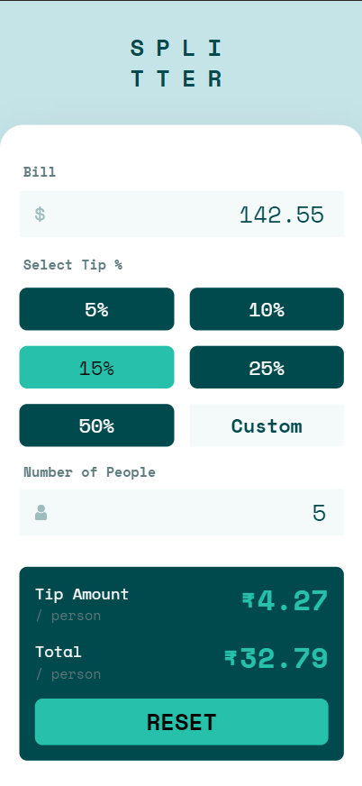
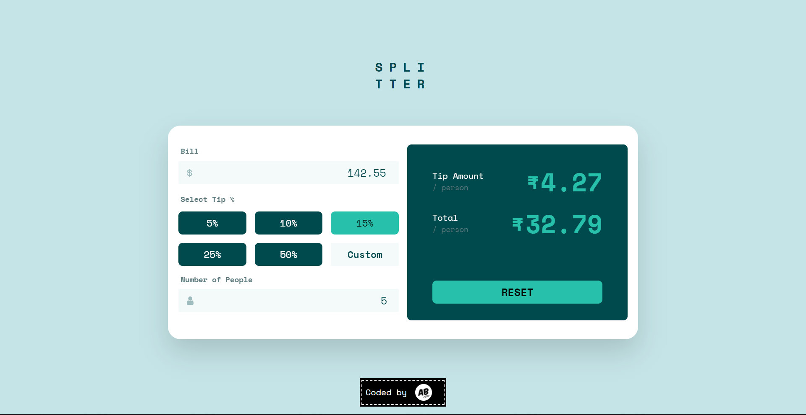

# Frontend Mentor - Tip calculator app solution

This is a solution to the [Tip calculator app challenge on Frontend Mentor](https://www.frontendmentor.io/challenges/tip-calculator-app-ugJNGbJUX). Frontend Mentor challenges help you improve your coding skills by building realistic projects.

## Table of contents

- [Overview](#overview)
  - [The challenge](#the-challenge)
  - [Screenshot](#screenshot)
  - [Links](#links)
- [My process](#my-process)
  - [Built with](#built-with)
  - [What I learned](#what-i-learned)
  - [Continued development](#continued-development)
  - [Useful resources](#useful-resources)
- [Author](#author)
- [Acknowledgments](#acknowledgments)

## Overview

### The challenge

Users should be able to:

- View the optimal layout for the app depending on their device's screen size
- See hover states for all interactive elements on the page
- Calculate the correct tip and total cost of the bill per person

### Screenshots

### Links

- Solution URL: [Add solution URL here](https://your-solution-url.com)
- Live Site URL: [Abhik B | Tip Calculator](https://abhik-b.github.io/tip-calculator-app-main/)

## My process

### Built with

- Semantic HTML5 markup
- Tailwind CSS
- Flexbox
- CSS Grid
- Mobile-first workflow

### What I learned

- How to use tailwind css

### Useful resources

- [Custom Fonts with Tailwind](https://dev.to/thelamina/using-custom-fonts-in-tailwind-css-5doi) - This is an amazing article which helped me in setting up custom fonts with tailwind

## Author

- Youtube - [Abhik B](https://www.youtube.com/c/abhikb/videos)
- Frontend Mentor - [@abhik-b](https://www.frontendmentor.io/profile/abhik-b)
- Twitter - [@\_abhikB](https://www.twitter.com/_abhikB)
